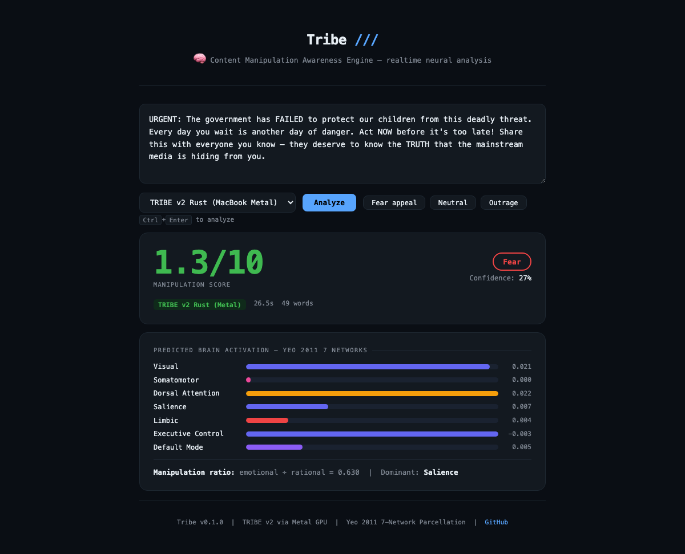

<p align="center">
  
  
  
  
</p>

# 🧠 Tribe — Neural Content Analysis

> **Run Meta's TRIBE v2 brain encoding model locally on your MacBook.**

Tribe analyzes any text and predicts how human brains respond to it — using the same neuroscience approach as Meta's research, but running entirely on Apple Silicon via Metal GPU acceleration.

## Demo Screenshots

**TRIBE v2 Rust (Metal GPU — brain network visualization):**


**Classifier backend (CPU — technique detection):**


---

```bash
$ tribe analyze "The government has FAILED to protect our children..."
⚠ This content is designed to trigger a FEAR response.
  Manipulation score: 4.0/10
  Primary trigger: Fear
  Backend: tribe_v2_rust | Time: 24s
```

## Why This Exists

TRIBE v2 (released March 2026) is a foundation model that predicts fMRI brain responses to any content — images, audio, text. It's genuinely cutting-edge neuroscience.

The problem: Meta's official release requires license approval for their LLaMA-based weights. We've built a workaround using `eugenehp/tribev2` (public weights, same model) + a Rust inference engine with Metal GPU support.

**Now TRIBE v2 runs on a MacBook.**

## Quick Start

```bash
# Install
pip install -e .

# Analyze text
tribe analyze article.txt

# Start the web demo (opens in browser)
tribe serve
```

### Hardware Requirements

| Component | Requirement |
|-----------|-------------|
| MacBook | M1, M2, or M3 (any variant) |
| RAM | 16GB recommended |
| Storage | 3GB for models |

## Features

### Two Backends

| Backend | Speed | Hardware | What It Measures |
|---------|-------|----------|------------------|
| **TRIBE v2 Rust** | ~25s | MacBook M-series (Metal GPU) | Predicted brain activation — 7 Yeo networks, 20k cortical vertices |
| **Classifier** | ~200ms | CPU (any machine) | Propaganda techniques + emotion ML |

### Demo Server

```bash
tribe serve --port 8000
```

Opens a beautiful browser interface with:
- One-click example buttons (Fear appeal, Neutral, Outrage)
- Real-time brain network visualization (Yeo 2011 7 networks)
- Backend selector (TRIBE v2 Rust vs Classifier)
- Keyboard shortcut: Ctrl+Enter to analyze

### CLI Commands

```bash
tribe analyze <file|url>          # Analyze content
tribe analyze --backend rust      # Force TRIBE v2 (Metal)
tribe analyze --backend cls       # Force Classifier (CPU)
tribe analyze --json              # JSON output
tribe analyze --verbose           # Full breakdown
tribe serve                       # Start demo server
tribe backends                    # Show available backends
tribe version                     # Version info
```

## Installation

### 1. Install Tribe

```bash
git clone https://github.com/iota31/tribe.git
cd tribe
pip install -e .
```

### 2. Build the Rust Binary (MacBook M-series only)

If you want TRIBE v2 (neural) instead of just Classifier:

```bash
# Install Rust (one-time)
curl --proto '=https' --tlsv1.2 -sSf https://sh.rustup.rs | sh -s -- -y

# Build tribev2-infer with Metal GPU support
git clone https://github.com/eugenehp/tribev2-rs /tmp/tribev2-rs
cd /tmp/tribev2-rs
cargo build --release --bin tribev2-infer --features "default,llama-metal"
```

### 3. Download LLaMA 3.2 3B (if using Ollama)

```bash
ollama pull llama3.2
```

That's it. Run `tribe backends` to verify:

```
Tribe — Backend Status
────────────────────────────────────────

Hardware:
  GPU: Apple Silicon (MPS) ✓

Backends:
  Classifier: ✓ available
  TRIBE v2 Rust: ✓ available
```

## How It Works

```
┌─────────────────────────────────────────────────────────────┐
│  Text: "The government has FAILED to protect our children" │
└─────────────────────────────────────────────────────────────┘
                            │
                            ▼
┌─────────────────────────────────────────────────────────────┐
│  LLaMA 3.2 3B GGUF (via llama-cpp-4, Metal GPU)            │
│  → Extracts text features at layers 0.5, 1.0 (6144 dims)   │
└─────────────────────────────────────────────────────────────┘
                            │
                            ▼
┌─────────────────────────────────────────────────────────────┐
│  Fusion Transformer (eugenehp/tribev2, Metal GPU)          │
│  → Predicts fMRI response: 100 timesteps × 20,484 vertices │
└─────────────────────────────────────────────────────────────┘
                            │
                            ▼
┌─────────────────────────────────────────────────────────────┐
│  Yeo 2011 7-Network Interpretation                          │
│  → Maps 20k cortical vertices → 7 functional networks      │
│  → Computes manipulation ratio (emotional / rational)      │
└─────────────────────────────────────────────────────────────┘
                            │
                            ▼
         ┌─────────────────────────────────┐
         │  Manipulation Score: 0.8/10     │
         │  Primary Trigger: Fear          │
         │  Brain Networks: Visual,        │
         │    Dorsal Attention, Salience,  │
         │    Default Mode...              │
         └─────────────────────────────────┘
```

## Architecture

```
tribe/
├── cli.py              # Click CLI (analyze, serve, backends)
├── server.py           # FastAPI demo server
├── analyze.py          # Main orchestrator
├── backends/
│   ├── router.py       # Hardware detection + backend selection
│   ├── classifier.py   # QCRI BERT (18 techniques) + DistilRoBERTa
│   └── tribe_v2_rust.py # TRIBE v2 via tribev2-rs + Metal
├── interpretation/
│   ├── neural.py       # Yeo 7-network mapping
│   └── technique.py    # Propaganda technique detection
└── output/
    ├── narrative.py    # Terminal output
    └── json_output.py  # JSON API output
```

## Models Used

| Model | Purpose | Size |
|-------|---------|------|
| `eugenehp/tribev2` | Fusion transformer fMRI predictor | 676MB |
| LLaMA 3.2 3B GGUF | Text feature extraction (via Ollama) | 1.9GB |
| QCRI BERT | 18-class propaganda technique detection | ~400MB |
| DistilRoBERTa | 8-class emotion classification | ~300MB |
| Yeo 2011 7-Network | Brain atlas parcellation | 164KB |

## License

**Tribe package:** [GPL-3.0](./LICENSE) — Copyright 2026 Tushar

**TRIBE v2 components:** [CC-BY-NC-4.0](./LICENSE-TRIBE-V2) — by Meta AI, non-commercial research use only

> Tribe is open-source. TRIBE v2 model weights are non-commercial. See [LICENSE-TRIBE-V2](./LICENSE-TRIBE-V2) for details.

## Roadmap

- [x] Run TRIBE v2 on MacBook M-series
- [x] Rust inference with Metal GPU acceleration
- [x] Web demo server
- [ ] LLM-powered explanation of brain activation patterns
- [ ] Local content history / media diet tracker
- [ ] RSS feed batch analysis

## Acknowledgments

- [Meta AI](https://ai.meta.com/research/publications/tribe-v2/) — TRIBE v2 model
- [eugenehp/tribev2](https://huggingface.co/eugenehp/tribev2) — Public weights fork
- [eugenehp/tribev2-rs](https://github.com/eugenehp/tribev2-rs) — Rust inference engine
- [Yeo et al. 2011](https://doi.org/10.1007/s00429-010-0812-4) — 7-Network functional parcellation