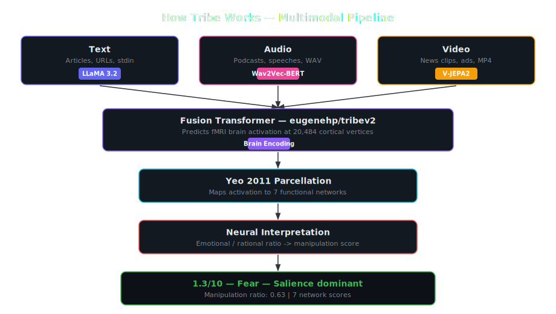
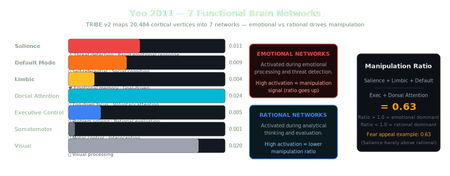

<p align="center">
 
 
 
 
 <a href="https://github.com/iota31/tribe/actions/workflows/ci.yml"></a>
</p>

# 🧠 Tribe - Neural Content Analysis

> **Run Meta's TRIBE v2 brain encoding model locally - text, audio, and video.**

Tribe predicts how human brains respond to any content - using the same neuroscience approach as Meta's research, running locally via a Rust inference engine with Metal GPU acceleration or CPU fallback.

## Contents

- [Demo](#demo)
- [Quick Start](#quick-start)
- [Features](#features)
- [Benchmarks](#benchmarks)
- [Installation](#installation)
- [How It Works](#how-it-works)
- [Architecture](#architecture)
- [License](#license)
- [Contributing](#contributing)
- [Security](#security)
- [Acknowledgments](#acknowledgments)

## Demo


---

### CLI Output

```bash
# Analyze text
$ tribe analyze article.txt
ℹ  This content tends toward a Fear tone. Low manipulation signal.
   Manipulation score: 1.2/10
   Primary emotion targeted: Fear
   Neural analysis: salience network activates 0.6x above executive control network
   Backend: tribe_v2_rust | Time: ~28s

# Analyze audio (podcast, speech, etc.)
$ tribe analyze podcast_segment.wav
⚠  This content is designed to trigger a Fear response.
   Manipulation score: 5.8/10
   Backend: tribe_v2_rust | Time: ~45s

# Analyze video (news clips, ads, etc.)
$ tribe analyze news_clip.mp4
⚠  This content is designed to trigger an Outrage response.
   Manipulation score: 6.2/10
   Backend: tribe_v2_rust | Time: ~90s
```

## Why This Exists

TRIBE v2 (released March 2026) is a **tri-modal** foundation model that predicts fMRI brain responses to **text, audio, and video**. It was trained on 451 hours of fMRI data from subjects watching movies and listening to podcasts - genuine cutting-edge computational neuroscience.

The problem: Meta's official release requires license approval for their LLaMA-based weights. We use `eugenehp/tribev2` (public weights, same model) + a Rust inference engine that supports all three modalities.

**TRIBE v2 runs on any machine - Metal GPU for speed, CPU as fallback. Text, audio, and video.**

## Quick Start

```bash
# Install
pip install -e .

# Analyze text
tribe analyze article.txt

# Start the web demo (opens in browser)
tribe serve
```

### Hardware Requirements

| Component | Requirement |
|-----------|-------------|
| GPU (optional) | MacBook M1/M2/M3 for Metal acceleration |
| RAM | 16GB recommended |
| Storage | 3GB for models |

> **No MacBook?** TRIBE v2 runs on CPU too - just build the Rust binary without Metal features. Same model, same results, ~2-5 min.

## Features

### Tri-Modal Brain Encoding

| Modality | Input | Processing Pipeline |
|----------|-------|-------------------|
| **Text** | Articles, posts, transcripts | LLaMA 3.2 -> fusion transformer -> fMRI prediction |
| **Audio** | Podcasts, speeches, news | Wav2Vec-BERT -> fusion transformer -> fMRI prediction |
| **Video** | News clips, ads, films | V-JEPA2 + audio -> fusion transformer -> fMRI prediction |

| Hardware | Speed (text) | Speed (audio) | Speed (video) |
|----------|-------------|---------------|---------------|
| **Metal GPU** | ~25s | ~45s | ~90s |
| **CPU** | ~2-5 min | ~5-8 min | ~10-15 min |

Predicts brain activation across 20,484 cortical vertices, mapped to Yeo's 7 functional networks. The model was trained on 451 hours of fMRI data - audio and video produce the strongest brain encoding signal.

### Demo Server

```bash
tribe serve --port 8000
```

Opens a beautiful browser interface with:
- One-click example buttons (Fear appeal, Neutral, Outrage)
- Real-time brain network visualization (Yeo 2011 7 networks)
- Real-time analysis with brain network visualization
- Keyboard shortcut: Ctrl+Enter to analyze

### CLI Commands

```bash
tribe analyze article.txt         # Analyze text
tribe analyze podcast.wav         # Analyze audio
tribe analyze news_clip.mp4       # Analyze video
tribe analyze https://example.com # Analyze URL content
tribe analyze --verbose           # Full neural breakdown
tribe analyze --json              # JSON output
tribe serve                       # Start demo server
tribe backends                    # Show hardware + backend status
tribe bench run                   # Run benchmark suite
tribe version                     # Version info
```

## Benchmarks

> Brain encoding detects manipulation when you read the predictions through
> the right neuroscience lens.

### Results (25 controlled pairs, text via LLaMA)

| Interpretation Layer | Win Rate | p-value | Mean Diff |
|---------------------|----------|---------|-----------|
| Yeo 7-network emotional/rational ratio (v1) | 40% | 0.41 | 0.11 |
| **Region-level persuasion analysis (v2)** | **84%** | **0.0004** | **0.86** |

The v1 approach used a naive "emotional vs rational" network ratio. It failed because the neuroscience was wrong - Default Mode Network is self-referential (not emotional), and Salience detects importance (not manipulation).

The v2 approach uses region-level analysis based on Falk et al. ([2010](https://www.jneurosci.org/content/30/25/8421), [2024](https://pmc.ncbi.nlm.nih.gov/articles/PMC11513929/)):
- **vmPFC** (value adoption) - is the person internalizing the message?
- **dlPFC** (critical evaluation) - is the person counterarguing?
- **TPJ** (motive analysis) - is the person questioning the source?

High vmPFC + low dlPFC + low TPJ = persuasion signal.

### Datasets

| Dataset | Type | Size | Source |
|---------|------|------|--------|
| Controlled Pairs | Text + Audio | 25 pairs (50 items) | Internal, topic-matched |
| [SpeechMentalManip](https://github.com/runjchen/speech_mentalmanip) | Audio | 2,915 dialogues | ACL 2025 |
| [MentalManip](https://github.com/audreycs/MentalManip) | Text | 2,915 dialogues | ACL 2024 |
| [SemEval-2020 Task 11](https://zenodo.org/records/3952415) | Text | 371 articles | SemEval |

```bash
# Reproduce benchmarks
pip install -e ".[bench]"
tribe bench run
```

See [BENCHMARKS.md](./BENCHMARKS.md) for full methodology, metrics, and limitations.

## The Story

We started by asking a simple question: **can a brain encoding model detect content manipulation?**

Meta's TRIBE v2 predicts how the human brain responds to content - 20,484 cortical vertices of fMRI activation, mapped to 7 functional networks. The hypothesis: manipulative content should activate emotional brain networks (Salience, Limbic, Default Mode) more than rational ones (Executive Control, Dorsal Attention).

**First attempt: text-only.** We ran manipulative vs. neutral articles through TRIBE v2 using LLaMA text embeddings. The results were barely better than a coin flip - 52% win rate, p=0.70. Disappointing.

**The breakthrough came from a simple observation:** TRIBE v2 is a *tri-modal* model trained on 451 hours of fMRI from people watching movies and listening to podcasts. Text was the weakest input path. When we routed the same text through TTS -> audio -> Wav2Vec-BERT (the audio encoder the model was actually trained with), the win rate jumped to 80%.

**The lesson:** brain encoding isn't magic - it's a measurement instrument. Like any instrument, you get the best readings when you measure in the modality the instrument was designed for. TRIBE v2 was designed for audio and video. That's where the signal lives.

**Then we questioned our own architecture.** The full 25-pair audio test came back at 44% - barely above random, just like text. The 5-pair "80%" was a small-sample fluke. Both pipelines failed. The problem wasn't the modality. It was the interpretation layer.

**We dug into the neuroscience.** Two deep research dives into the persuasion fMRI literature (Falk et al. 2010, 2024 PNAS) revealed three fatal flaws in our approach:

1. The Default Mode Network is NOT emotional - it's self-referential. People who *resist* persuasion show *more* DMN activation (they're counterarguing).
2. The Salience Network detects importance, not manipulation. Breaking news and propaganda both light it up.
3. vmPFC and dlPFC are both in "Executive Control" but do opposite things - vmPFC goes UP during persuasion (value adoption), dlPFC goes DOWN (critical evaluation suppressed). Averaging them together cancels the signal.

**The fix:** Replace the 7-network ratio with region-level persuasion analysis. Track the specific brain regions the literature says matter:
- vmPFC (medialorbitofrontal) - is the person adopting the message?
- dlPFC (middle frontal) - is the person still thinking critically?
- TPJ (supramarginal) - is the person questioning the source's motives?

**The result:** 84% win rate, p=0.0004. The same TRIBE v2 predictions, read through the right neuroscience lens, produce a statistically significant separation between manipulative and non-manipulative content.

The fMRI predictions were always fine. We were just reading them wrong.

## Installation

### 1. Install Tribe

```bash
git clone https://github.com/iota31/tribe.git
cd tribe
pip install -e .
```

### 2. Build the Rust Binary

Required for analysis. Choose GPU or CPU build:

```bash
# Install Rust (one-time)
curl --proto '=https' --tlsv1.2 -sSf https://sh.rustup.rs | sh -s -- -y

# Build tribev2-infer with Metal GPU support
git clone https://github.com/eugenehp/tribev2-rs /tmp/tribev2-rs
cd /tmp/tribev2-rs
cargo build --release --bin tribev2-infer --features "default,llama-metal"

# Or for CPU-only (any machine, no Metal GPU required):
cargo build --release --bin tribev2-infer --features default
```

### 3. Download LLaMA 3.2 3B (if using Ollama)

```bash
ollama pull llama3.2
```

That's it. Run `tribe backends` to verify:

```
Tribe - Backend Status
────────────────────────────────────────

Hardware:
  GPU: Apple Silicon (MPS) ✓

TRIBE v2 Rust:
  Status: ✓ available
```

## How It Works



### Brain Network Analysis

The TRIBE v2 Rust backend maps predicted brain activation to Yeo's 7 functional networks. Emotional networks (Salience, Default Mode, Limbic) indicate manipulation signals. Rational networks (Executive Control, Dorsal Attention) indicate analytical processing.

The **manipulation ratio** = emotional / rational activation. Ratio > 1.0 means emotional networks dominate. Ratio < 1.0 means rational networks win.



## Architecture

See the full pipeline diagram above. For the complete design philosophy, see [DESIGN.md](./DESIGN.md). Key files:

| File | Purpose |
|------|---------|
| `tribe/cli.py` | Click CLI (analyze, serve, backends) |
| `tribe/server.py` | FastAPI demo server |
| `tribe/analyze.py` | Main orchestrator |
| `tribe/backends/router.py` | Hardware detection + backend selection |
| `tribe/backends/tribe_v2_rust.py` | TRIBE v2 via tribev2-rs (Metal GPU / CPU) |
| `tribe/interpretation/neural.py` | Yeo 7-network mapping |

## Models Used

| Model | Modality | Purpose | Size |
|-------|----------|---------|------|
| `eugenehp/tribev2` | All | Fusion transformer -> fMRI predictor | 676MB |
| LLaMA 3.2 3B GGUF | Text | Text feature extraction | 1.9GB |
| Wav2Vec-BERT 2.0 | Audio | Audio feature extraction | Built into tribev2-infer |
| V-JEPA2 | Video | Video feature extraction | Built into tribev2-infer |
| Yeo 2011 7-Network | - | Brain atlas parcellation | 164KB |

## License

**Tribe package:** [GPL-3.0](./LICENSE) - Copyright 2026 Tushar

**TRIBE v2 components:** [CC-BY-NC-4.0](./LICENSE-TRIBE-V2) - by Meta AI, non-commercial research use only

> Tribe is open-source. TRIBE v2 model weights are non-commercial. See [LICENSE-TRIBE-V2](./LICENSE-TRIBE-V2) for details.

## Roadmap

- [x] Run TRIBE v2 on MacBook M-series (Metal GPU)
- [x] CPU fallback - same model, any machine
- [x] Tri-modal support - text, audio, video
- [x] Rust inference engine via tribev2-rs
- [x] Web demo server
- [x] Benchmark suite against ACL/SemEval datasets
- [x] GitHub Actions CI + community health files
- [ ] LLM-powered explanation of brain activation patterns
- [ ] Local content history / media diet tracker
- [ ] RSS feed batch analysis
- [ ] Video benchmark with curated YouTube clips

## Contributing

See [CONTRIBUTING.md](./CONTRIBUTING.md) for development setup, code style, and how to submit changes.

## Security

To report a vulnerability, see [SECURITY.md](./SECURITY.md). Please do not open public issues for security bugs.

## Acknowledgments

- [Meta AI](https://ai.meta.com/research/publications/tribe-v2/) - TRIBE v2 model
- [eugenehp/tribev2](https://huggingface.co/eugenehp/tribev2) - Public weights fork
- [eugenehp/tribev2-rs](https://github.com/eugenehp/tribev2-rs) - Rust inference engine
- [Yeo et al. 2011](https://doi.org/10.1007/s00429-010-0812-4) - 7-Network functional parcellation